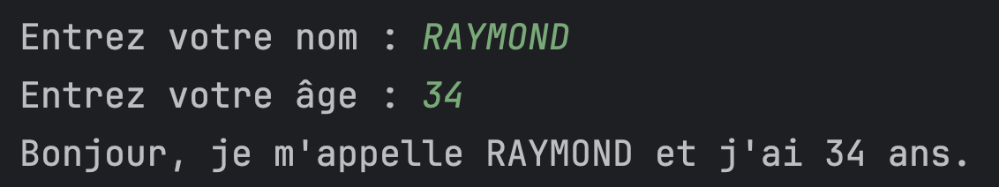
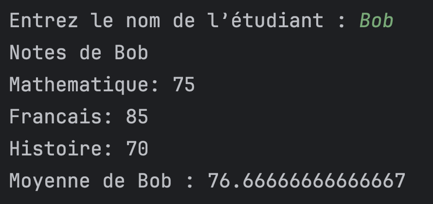
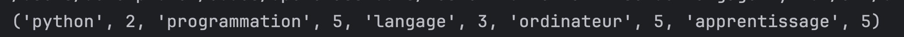
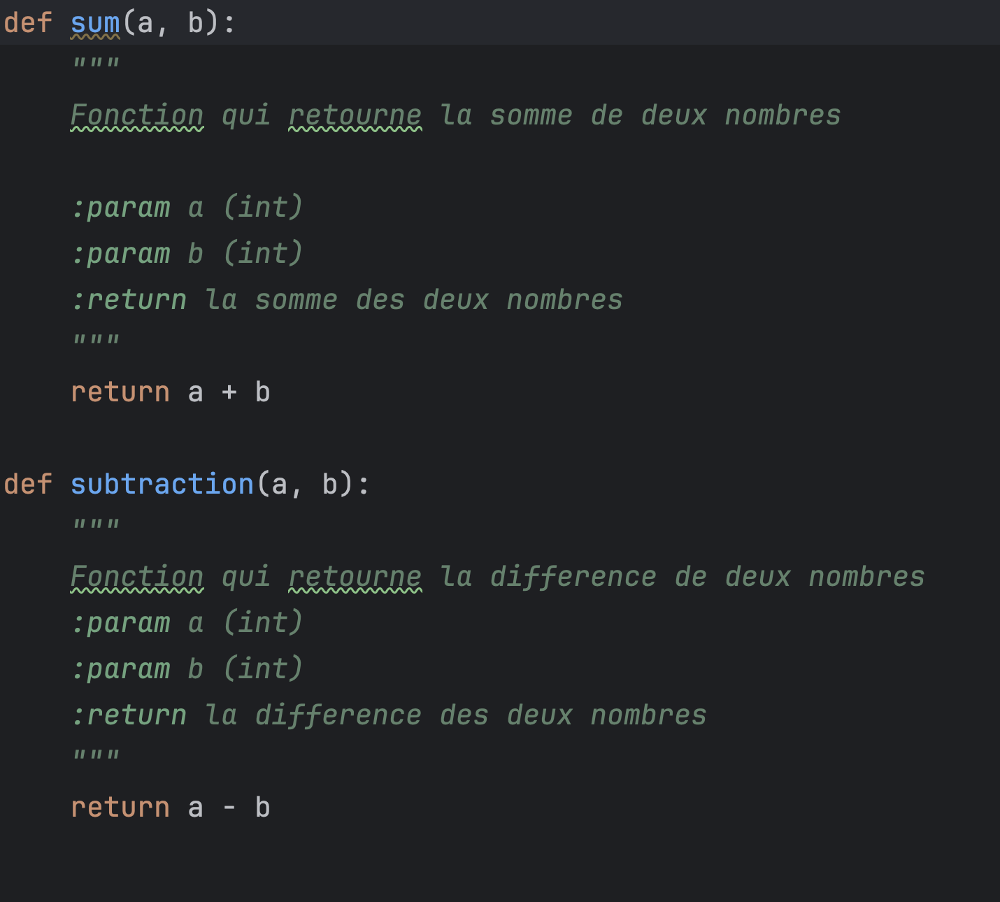
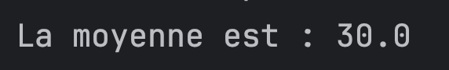
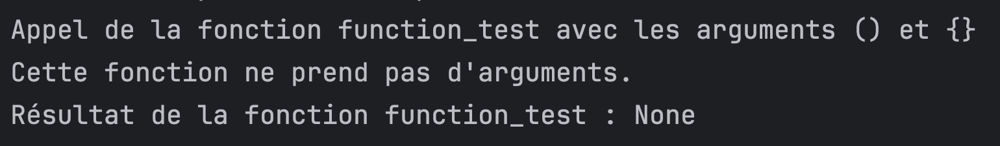
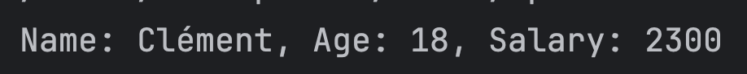
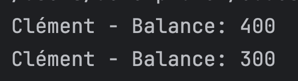
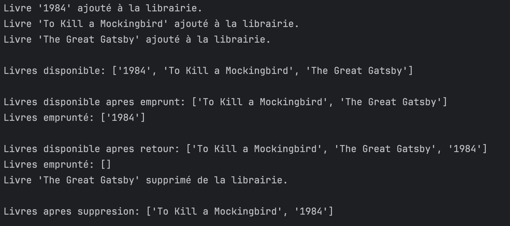

# Openclassrooms: Testez votre maîtrise du langage Python

## Résultats des exercices

### Exercice 1

### Exercice 2

### Exercice 3

### Exercice 4

### Exercice 5

### Exercice 6

### Exercice 7

### Exercice 8

### Exercice 9

### Exercice 10

### Exercice 11

### Exercice 12

